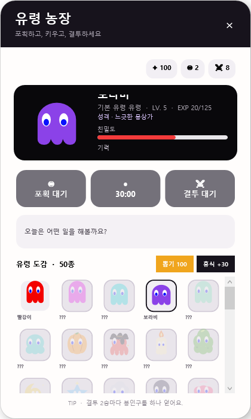
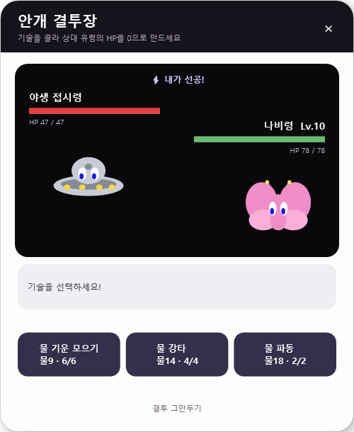
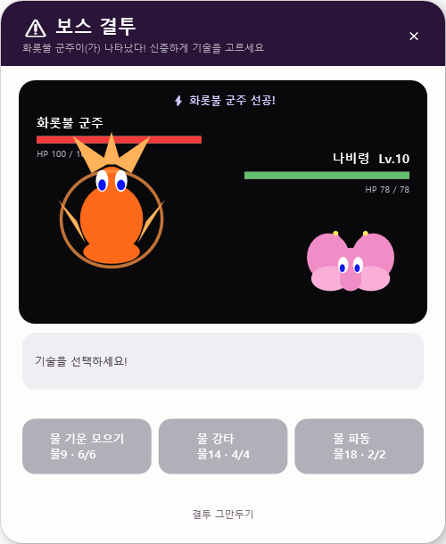

# 유령사냥

야행성 유령을 포획하고 키우고 결투시키는 데스크톱 위젯 게임입니다. 화면 위를 자유롭게 돌아다니는 유령 친구와 함께 안개 숲에서 새로운 유령을 포획하고, 도감을 채우고, 결투로 실력을 겨뤄보세요.

## 스크린샷

| 농장 / 도감 | 결투 | 보스 결투 |
|---|---|---|
|  |  |  |

## 주요 기능

- **포획**: 화면 위를 돌아다니는 야생 유령을 미니게임으로 포획. 기본 50종 + 보스 10종 도감
- **육성**: 레벨·경험치·친밀도·기력을 관리하며 유령을 성장시키기
- **결투**: 불·물·자연·빛·어둠 5속성 상성, 화상·마비·보호막·회복 상태이상, 스피드 기반 선공권, 사용횟수 제한이 있는 기술
- **보스 결투**: 레벨/누적 승수 조건과 확률로 등장하는 5속성 × 2티어 보스 10종. 최초 격파 시 도감·뽑기에 영구 등록
- **데스크톱 상주**: 유령이 화면 위를 스스로 돌아다니며 포획·결투·심부름 알림을 무작위로 보냄
- **진행 상황 자동 저장**: 앱을 껐다 켜도 포획한 유령·루나·봉인구·레벨이 유지됨

## 실행

### 그냥 플레이하고 싶다면

`GhostWidget/dist/GhostWidget.exe`를 받아서 바로 실행하세요. 자체 포함(self-contained) 단일 실행 파일이라 .NET 런타임 설치가 필요 없습니다. (이 경로는 빌드 후에만 존재합니다 — 아래 "배포용 빌드" 참고.)

### 소스에서 빌드하려면

[.NET 10 SDK](https://dotnet.microsoft.com/download)와 Windows가 필요합니다.

```bash
cd GhostWidget
dotnet run
```

### 배포용 단일 실행 파일 빌드

```bash
dotnet publish GhostWidget/GhostWidget.csproj -c Release -o GhostWidget/dist
```

`GhostWidget/dist/GhostWidget.exe`가 생성됩니다.

## 프로젝트 구조

```
GhostWidget/
  MainWindow.xaml(.cs)     메인 유령 위젯 — 게임 상태, 저장/로드, 유령 도감
  BattleWindow.xaml(.cs)   결투 시스템
  BattleTypes.cs           속성 상성 · 상태이상 · 결투 계산 로직
  GhostArtwork.cs          전 유령 종족(보스 포함)의 벡터 아트
  FarmWindow / CaptureGameWindow / QuestWindow  농장 · 포획 · 심부름 미니게임
index.html                 초기 웹 프로토타입 (참고용, 실제 게임과 무관)
```

자세한 조작법은 [GhostWidget/README.md](GhostWidget/README.md)를 참고하세요.

## 기술 스택

.NET 10 · WPF · C#
